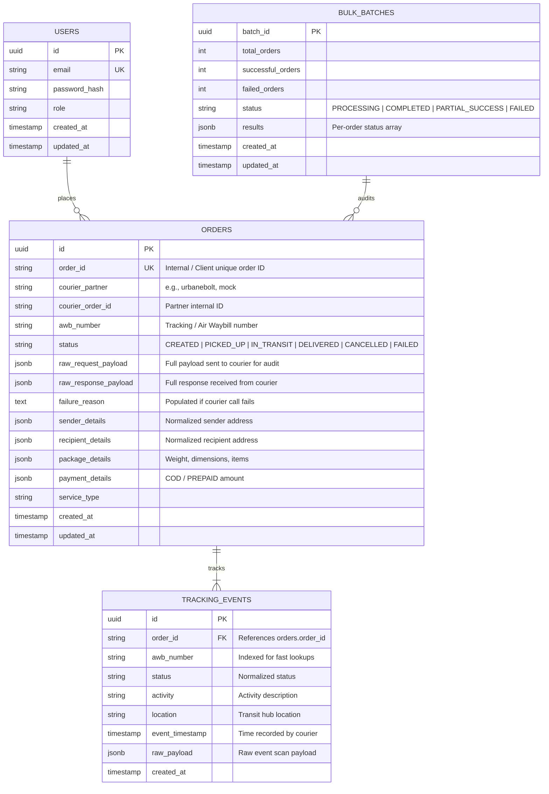

# Architectural Design Document (DESIGN.md)
## Multi-Courier Integration Platform Backend

---

## 1. Executive Summary & Problem Context
Modern e-commerce logistics platforms require integration with dozens of courier aggregators and third-party logistics (3PL) partners (e.g., UrbaneBolt, Delhivery, Shiprocket, BlueDart, DTDC). Each partner introduces distinct:
- Authentication protocols (JWT Bearer tokens, API Keys, OAuth2, session cookies).
- Data models & field nomenclature (e.g., `shprPincode` vs `pickup_pincode`, `payMode` vs `payment_type`).
- Rate limits, latency profiles, and failure semantics.

The primary objective of this platform is to provide **ONE unified, courier-agnostic API contract** to internal services (Order Management Systems, Warehouse Management Systems, Frontend Storefronts) while isolating all partner-specific intricacies behind a **pluggable adapter architecture**.

---

## 2. Architecture & Design Patterns

### 2.1 Pluggable Adapter Pattern & Factory/Registry Pattern
The system decouples internal business logic and controllers from external courier APIs using the **Adapter Pattern** combined with a singleton **Courier Registry (Factory)**.

```
       +-------------------------------------------------------------+
       |                  Unified REST API Consumer                  |
       |  (e.g., Order Management System / Web Checkout / Mobile)    |
       +------------------------------+------------------------------+
                                      |
                                      v
       +-------------------------------------------------------------+
       |      API Layer: Helmet + CORS + Winston + JWT + AJV        |
       +------------------------------+------------------------------+
                                      |
                                      v
       +-------------------------------------------------------------+
       |                     Order / Bulk Service                    |
       |       - Idempotency Guarantee                               |
       |       - Audit Logging & Failure Recording                   |
       |       - Concurrency Limiter Pool                            |
       +------------------------------+------------------------------+
                                      |
                                      v
       +-------------------------------------------------------------+
       |             CourierRegistry (Adapter Factory)               |
       |       - O(1) Adapter Resolution                             |
       |       - Zero modification required to add couriers          |
       +--------------+-------------------------------+--------------+
                      |                               |
                      v                               v
       +------------------------------+ +------------------------------+
       |     UrbaneBoltAdapter        | |      MockCourierAdapter      |
       |  - Token Auto-refresh        | |  - Offline Testing / CI      |
       |  - Exponential Backoff       | |  - Proof of Extensibility    |
       |  - DTO Bidirectional Mapping | |                              |
       +--------------+---------------+ +--------------+---------------+
                      |                               |
                      v                               v
            UrbaneBolt UAT API             Simulated Logistics Engine
         (https://uat.urbanebolt.in)
```

#### Key Advantages:
1. **Open/Closed Principle (SOLID)**: The core system is open for extension (adding new couriers) but closed for modification. Adding a new courier partner requires **zero changes** to controllers, routes, unified DTOs, or existing services.
2. **Standardized Contract (`ICourierAdapter`)**:
   ```typescript
   export interface ICourierAdapter {
     readonly partnerName: string;
     createShipment(order: NormalizedCreateOrderRequest): Promise<NormalizedCreateOrderResponse>;
     trackShipment(awbNumber: string, orderId?: string): Promise<NormalizedTrackingResponse>;
     cancelShipment(awbNumber: string, orderId?: string, reason?: string): Promise<NormalizedCancelResponse>;
   }
   ```
3. **Registry Discovery**:
   Adapters register themselves into `CourierRegistry.getInstance().register(adapter)`. When an order request arrives, `courierRegistry.get(partnerName)` resolves the concrete implementation dynamically.

---

## 3. Database Schema & Data Modeling

The platform uses **PostgreSQL** managed through **Sequelize ORM** with connection pooling.



### Persistence Guarantees:
- **Append-Only Tracking History**: `tracking_events` never updates existing rows; it appends each scan event with its timestamp and raw courier payload for auditability and timeline reconstruction.
- **Audit & Failure Reconciliation**: If an external courier call fails after retries, the order is persisted with `status: FAILED` along with `failure_reason` and `raw_response_payload` so that reconciliation workers can retry or alert operators.

---

## 4. Bulk Processing & Concurrency Architecture

### Problem:
A consumer submits up to 100 orders in a single request `POST /api/v1/orders/bulk`. 
Calling external couriers 100 times **sequentially** causes high latency (~100 × 300ms = 30 seconds), leading to gateway timeouts. On the other hand, executing 100 requests **simultaneously** (`Promise.all`) floods external APIs, risking rate limits (HTTP 429) or socket starvation.

### Solution: Controlled Concurrency Pool
We implemented `runWithConcurrency<T, R>()` utilizing a worker pool pattern bounded by `BULK_CONCURRENCY_LIMIT` (default: `10` concurrent workers):

```
Batch Request (100 Orders)
       |
       +--> Worker 1  --> Process Order 1, 11, 21...
       +--> Worker 2  --> Process Order 2, 12, 22...
       ...
       +--> Worker 10 --> Process Order 10, 20, 30...
       |
       v
Aggregate Results (Maintains Order & Supports Partial Success)
```

#### Trade-off Analysis:
| Approach | Latency | Resource Overhead | Complexity | Choice |
| :--- | :--- | :--- | :--- | :--- |
| **Sequential (1 by 1)** | ❌ Very Slow (~30s) | Low | Low | Rejected |
| **Unbounded (`Promise.all`)** | ⚡ Fastest | ❌ Risk of 429 & Connection Spikes | Low | Rejected |
| **Controlled Worker Pool** | 🚀 High Throughput (~2-3s) | 🛡️ Predictable & Safe | Low | **Selected** |
| **Background Message Queue (BullMQ/Redis)** | 🚀 Async Response | Requires Redis Infrastructure | Medium | Discussed for scale (>1000 orders) |

- **Partial Success Handling**: Each order in the batch is isolated. If 95 succeed and 5 fail, the endpoint returns `HTTP 207 Multi-Status` with clear per-order status and field-level failure reasons.
- **Idempotency Guarantee**: Submitting the same `order_id` twice detects the existing active order and marks it as `SKIPPED_IDEMPOTENT` without duplicate courier calls.

---

## 5. Resiliency & Error Handling

### 5.1 Distributed Courier Token Management & Multi-Pod Redis Cache
UrbaneBolt uses token-based authentication. In multi-pod production environments (e.g. Kubernetes, AWS ECS, PM2 clusters), storing tokens solely in a local memory heap causes redundant authentication requests and out-of-sync invalidations. The platform implements a **Pluggable Distributed Cache Architecture (`ICacheService`)**:
1. **Centralized Redis Caching (`RedisCacheService`)**:
   - The bearer token is stored under `courier_platform:courier:token:urbanebolt` with a 12-hour TTL.
   - When **Pod 1** fetches a token, **all other pods** read that exact same token in `< 1ms` without making external auth calls.
2. **Distributed Lock (Stampede Prevention)**:
   - Uses atomic Redis `SET ... NX EX` locks so only one pod refreshes the token on expiration, preventing thundering herds.
3. **Cluster-Wide Invalidation on `401 Unauthorized`**:
   - If any pod receives an expired token error from UrbaneBolt, it deletes the Redis key `DEL courier_platform:courier:token:urbanebolt`, instantly refreshing the token across the entire cluster.
4. **Zero-Dependency Local Fallback (`MemoryCacheService`)**:
   - If `REDIS_URL` is omitted (local development and offline CI tests), the system gracefully switches to an in-memory TTL cache without crashing or requiring infrastructure.

### 5.2 Exponential Backoff with Jitter
For transient errors (5xx server errors, network drops, `ECONNABORTED` timeouts):
- Retries up to `COURIER_RETRY_ATTEMPTS` (default: 3).
- Applies exponential backoff: $Delay = \text{InitialDelay} \times (\text{Factor})^{\text{Attempt}-1} \times \text{Jitter}$.
- Random jitter (0.8x to 1.2x) prevents thundering herd synchronization.
- 4xx client errors (e.g. invalid pincode) fail fast and are **not** retried.

### 5.3 Single Normalized Error Response Structure
All errors (validation, auth, courier, database) conform to a unified contract:
```json
{
  "success": false,
  "error": {
    "code": "VALIDATION_ERROR",
    "message": "Validation failed for request payload",
    "details": [
      {
        "field": "recipient.pincode",
        "message": "must match pattern ^[0-9]{4,12}$"
      }
    ],
    "requestId": "f47ac10b-58cc-4372-a567-0e02b2c3d479",
    "timestamp": "2026-08-18T15:30:00.000Z"
  }
}
```

---

## 6. Security & Observability

### Security:
- **Helmet**: Secures HTTP response headers against clickjacking, MIME sniffing, and cross-site scripting.
- **CORS**: Configured for secure cross-origin API interactions.
- **JWT Authentication**: Enforces signed JWT tokens with bcrypt-hashed passwords.
- **AJV Strict Validation**: Eliminates injection vectors by validating JSON schemas before controller invocation.

### Observability:
- **Contextual Winston Logging**: Powered by Node.js `AsyncLocalStorage`, injecting `requestId`, `orderId`, and `courierPartner` into every log line without prop-drilling.
- **Format Flexibility**:
  - `LOG_FORMAT=text`: Colorized, human-readable console output for local development.
  - `LOG_FORMAT=json`: Structured single-line JSON logs ready for ELK / Datadog in production.
